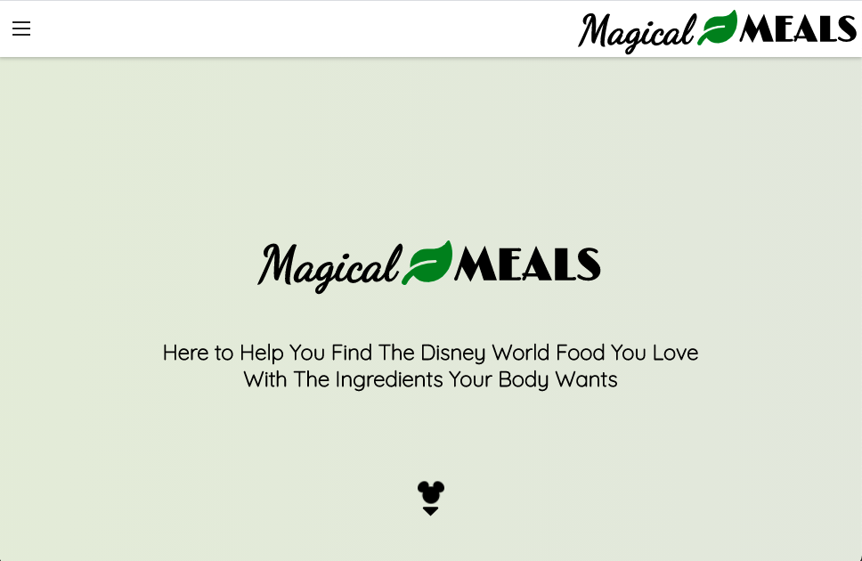
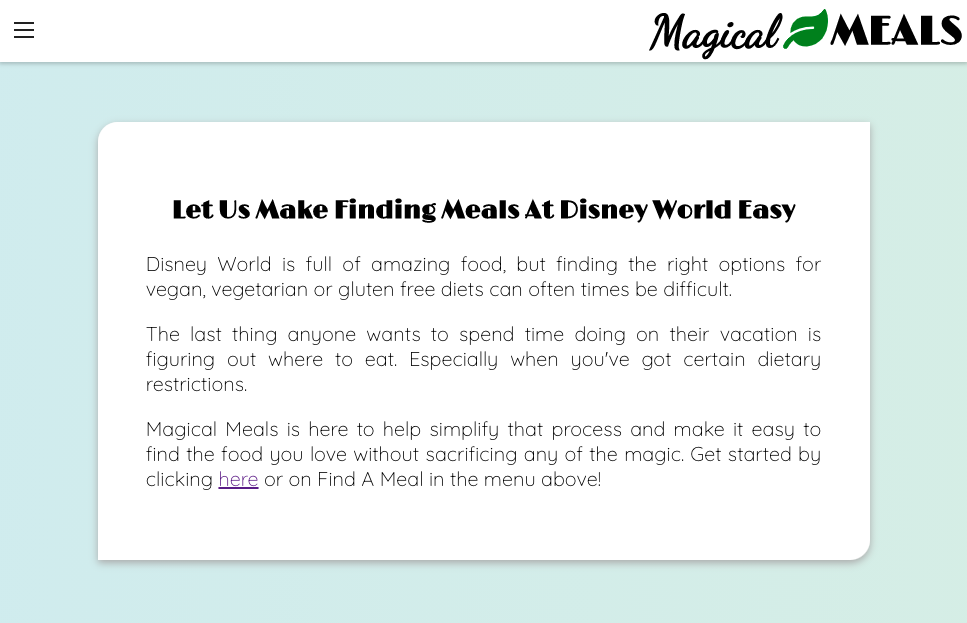
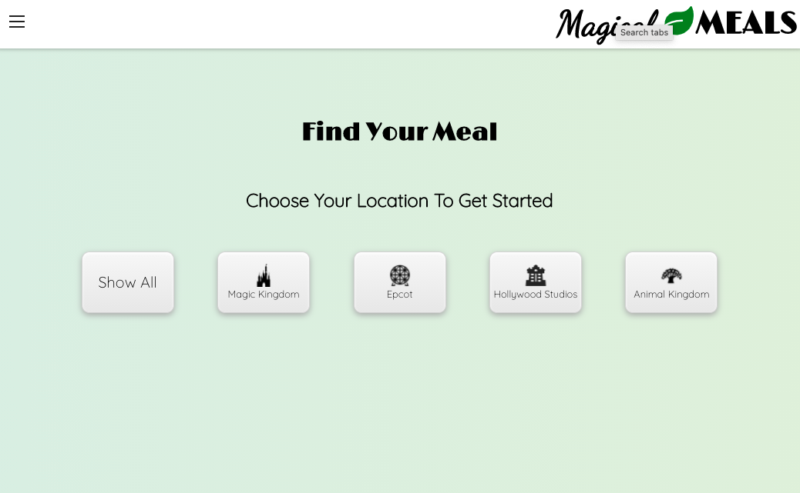
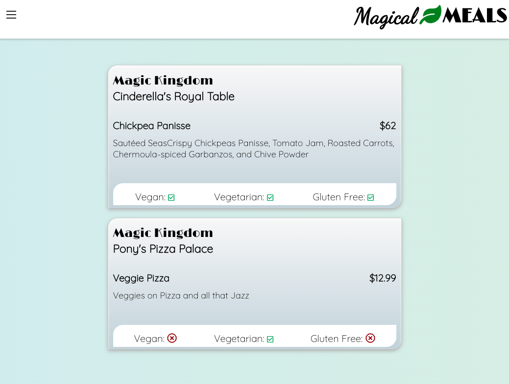
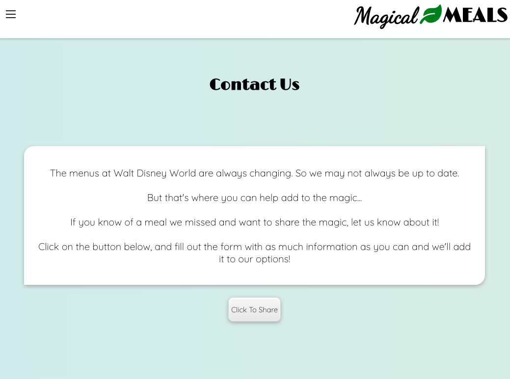
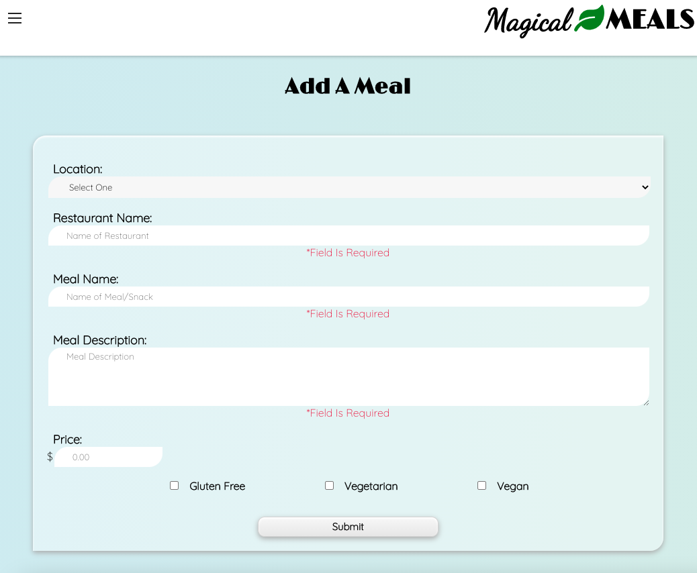

# Magical Meals

## Summary:

Magical-Meals-Api is a server-side project build for a client-side React app that can be viewed [here](https://github.com/CaitlinGreer/magical-meals.git).  Chuckles was deployed using Heroku.

## Technology:

This project was created using:
* PostgreSQL
* Node.js
* Express

## Check Out the Live Version:

[Magical Meals](https://magical-meals.vercel.app/)

## API Endpoints
* GET & POST: /api/meals
* DELETE: /api/meals/:id

## Screenshots

### Home Page

### Find A Meal Page

### Meal Results

### Contact Page

### Contact Form
